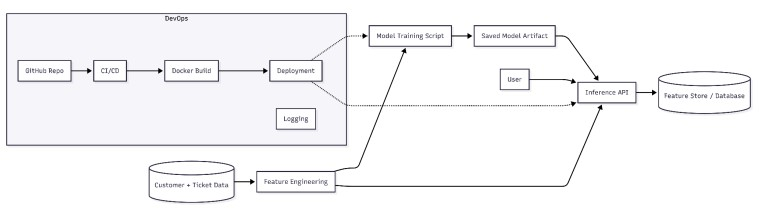
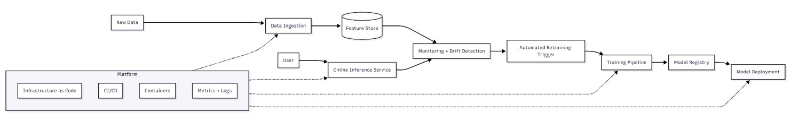

# Churn Risk Intelligence Service  
### DevOps + MLOps Architecture Assignment

**Name:** B. Chamith Kalyan  
**Roll No:** 2022BCS0117  

---

## Overview

This project presents a **Churn Risk Intelligence Service** designed as a production-style system that combines:

- a **rule-driven backend** for churn risk estimation,
- a **DevOps workflow** for build, test, deploy, and monitor,
- and an **MLOps-ready design** for future model training and lifecycle management.

The goal is to show how a simple prediction service can evolve from a basic API into a reliable, scalable, and observable machine learning system.

---

## Project Highlights

- REST API for churn risk prediction  
- Rule-based decision logic for current inference  
- Clean DevOps delivery pipeline  
- Container-based deployment  
- Automated testing  
- Metrics collection and monitoring  
- MLOps-friendly architecture for future expansion  

---

## Architecture at a Glance

| Layer | What It Does |
|------|--------------|
| Application Layer | Receives user requests and returns churn risk |
| Decision Layer | Applies business rules to estimate risk |
| DevOps Layer | Builds, tests, packages, and deploys the service |
| Observability Layer | Tracks API health, latency, and usage |
| MLOps Layer | Supports training, evaluation, and model lifecycle |

---

## 1. DevOps Architecture

  

---

## 2. ML-Ready Architecture

  

---

## 3. MLOps Production Architecture

  

---

## API Endpoints

### Base URL

http://localhost:8000

### Available Routes

| Endpoint        | Method | Purpose                       |
|----------------|--------|------------------------------|
| /              | GET    | Health check                 |
| /predict-risk  | POST   | Predict churn risk           |
| /metrics       | GET    | Expose Prometheus metrics    |
| /docs          | GET    | Interactive API documentation|

---

---

## Setup Instructions

### 1. Clone the repository

git clone <your-repository-link>  
cd <project-folder>

### 2. Install dependencies

pip install -r requirements.txt

### 3. Run the API

uvicorn src.app:app --host 0.0.0.0 --port 8000

---

## Docker Execution

### Build the image

docker build -t churn-risk-service .

### Run the container

docker run -p 8000:8000 churn-risk-service

---

## Monitoring Setup

### Start monitoring services

cd monitoring  
docker compose -f docker-compose.monitoring.yml up

### Monitoring Tools

| Tool       | Role                |
|------------|---------------------|
| Prometheus | Collects metrics    |
| Grafana    | Displays dashboards |

---

## Testing

Run the test suite with:

pytest

### Test Coverage Includes

- API response validation  
- rule engine verification  
- prediction logic checks  

---

## Technologies Used

| Category       | Tools           |
|----------------|----------------|
| Backend        | FastAPI        |
| Language       | Python         |
| Containers     | Docker         |
| CI/CD          | GitHub Actions |
| Testing        | Pytest         |

---

## Key Learnings

- ML systems require more than deployment  
- Data quality is as important as code quality  
- Monitoring must continue after release  
- MLOps helps make ML services reliable in production  

---

## Conclusion

This project demonstrates the progression from a simple rule-based service to a production-aware ML system.  
It shows how DevOps supports delivery, while MLOps ensures model reliability, traceability, and long-term performance.

---

## Acknowledgement

Prepared by  
B. Chamith Kalyan  
2022BCS0117
